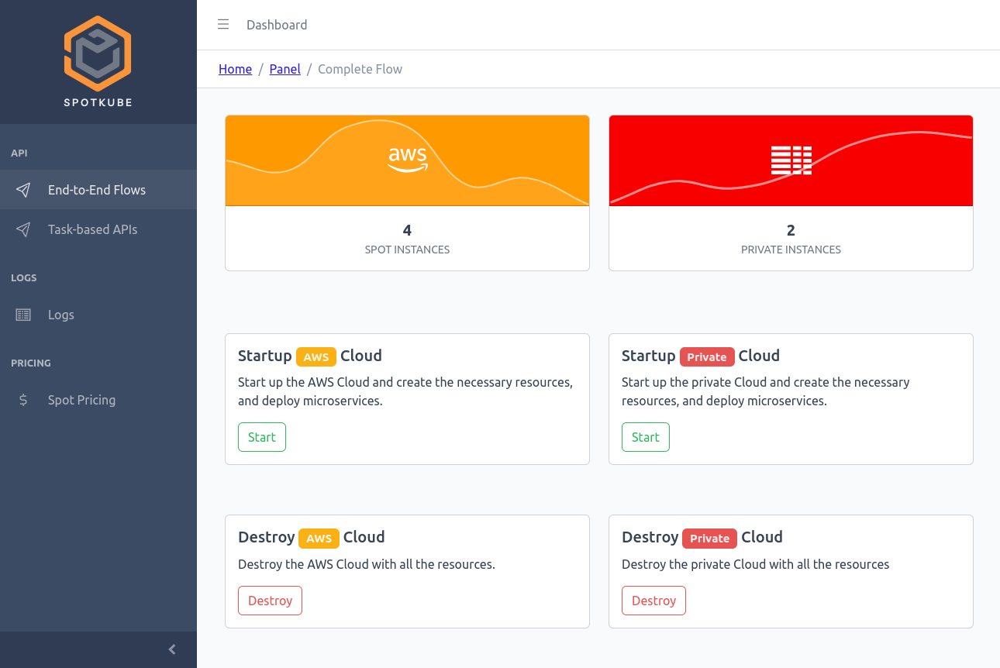
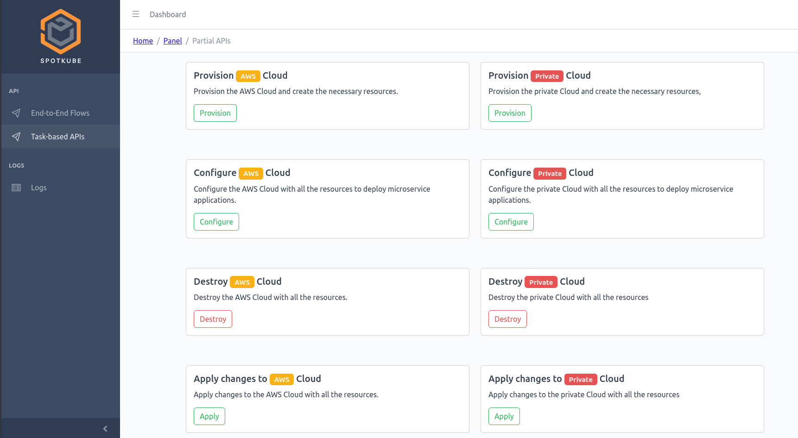
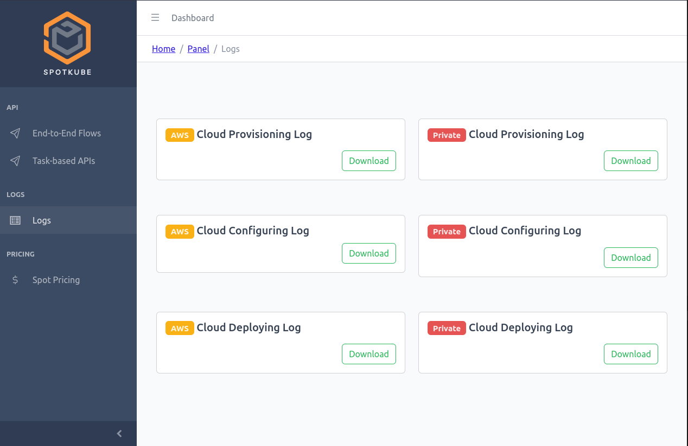
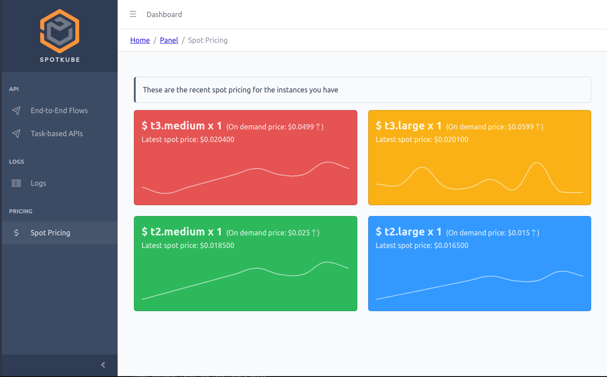

# SpotKube Web-UI

[](https://stackoverflow.com/questions/tagged/spotkube)
[](https://github.com/wso2/product-is/blob/master/LICENSE)

---


<p align="center">
  
</p>

SpotKube Web-UI is a React-based user interface for managing and monitoring microservices on the SpotKube platform. It provides a graphical interface for interacting with SpotKube's features and functionalities.

## Prerequisites

Before running the SpotKube Web-UI, ensure that you have the following prerequisites installed:

- Node.js (version 12 or above)
- npm (Node package manager)

<!-------------------------------------------------- Installation  --------------------------------------------------->

## Installation

Follow these steps to install and run the SpotKube Web-UI:

1. Clone the SpotKube Web-UI repository from GitHub:
   
   ```bash
   git clone https://github.com/SpotKube/Spotkube-UI.git
   ```

2. Navigate to the `SpotKube-UI` directory:
   
   ```bash
    cd SpotKube-UI
    ```

3. Install the dependencies:
    
    ```bash
    npm install
    ```

4. Run the application:
    
    ```bash
    npm start
    ```

5. Open the application in a browser at `http://localhost:3000`.

## Usage

The SpotKube Web-UI provides a graphical interface for interacting with SpotKube's features and functionalities. For more detailed information and usage instructions, please refer to the [SpotKube documentation](https://spotkube.github.io/).

### Dashboard

The Dashboard is the landing page of the SpotKube Web-UI. It provides an overview of the currently running AWS spot instances and private cloud instances. It also offers complete end-to-end APIs for deploying microservices and destroying cloud resources.

<p align="center">
  
</p>

### Task Based APIs

The Task Based APIs page provides a list of APIs that can be used to perform various operations, including node allocation, node configuration, microservice deployment, and cloud resource destruction.

<p align="center">
  
</p>

### Logs

The Logs page displays a list of logs generated by the SpotKube services. It includes the following log categories:

- Provisioning Logs: Logs generated during the node allocation process.
- Configuring Logs: Logs generated during the node configuration process.
- Deployment Logs: Logs generated during the microservice deployment process.

<p align="center">
  
</p>

### Spot Pricing

The Spot Pricing page provides a list of spot prices for different instance types that are currently running in AWS.

<p align="center">
  
</p>


<!-------------------------------------------------- License  --------------------------------------------------->
## License

SpotKube is released under the Apache 2.0 license. For more information, please refer to the [license file](https://github.com/SpotKube/SpotKube/blob/dev/LICENSE).

## Support

For support or assistance, please open an issue on the [SpotKube Web-UI repository](https://github.com/SpotKube/Spotkube-UI.git).


